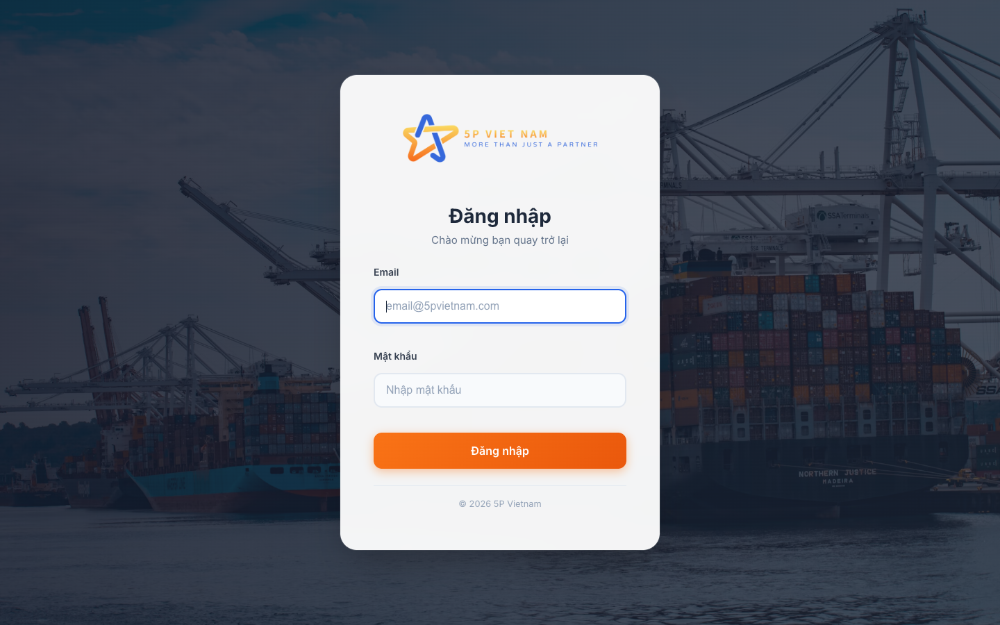
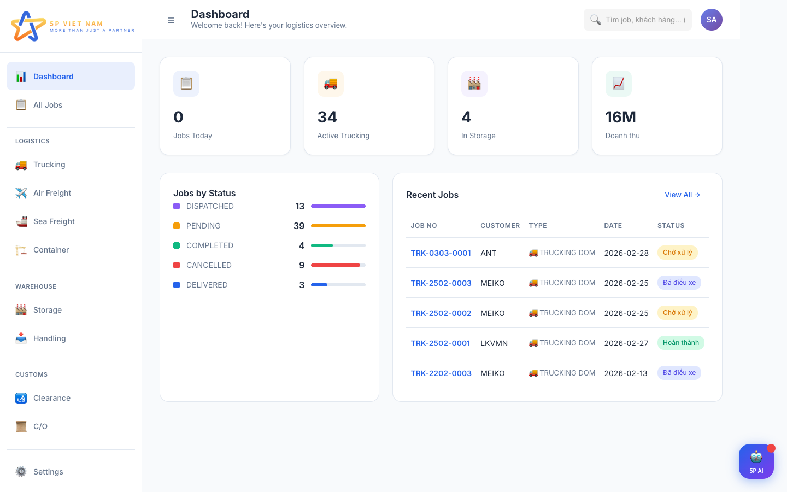
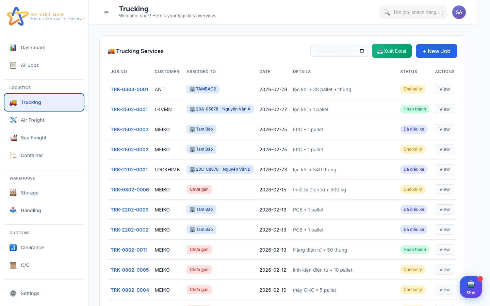
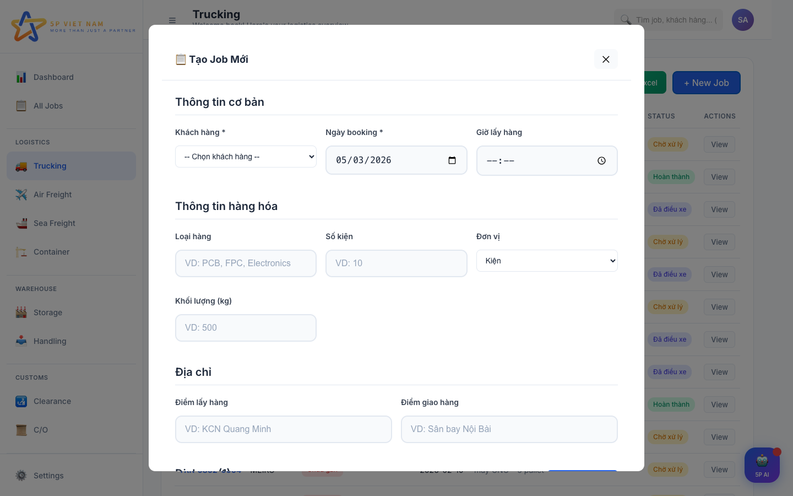
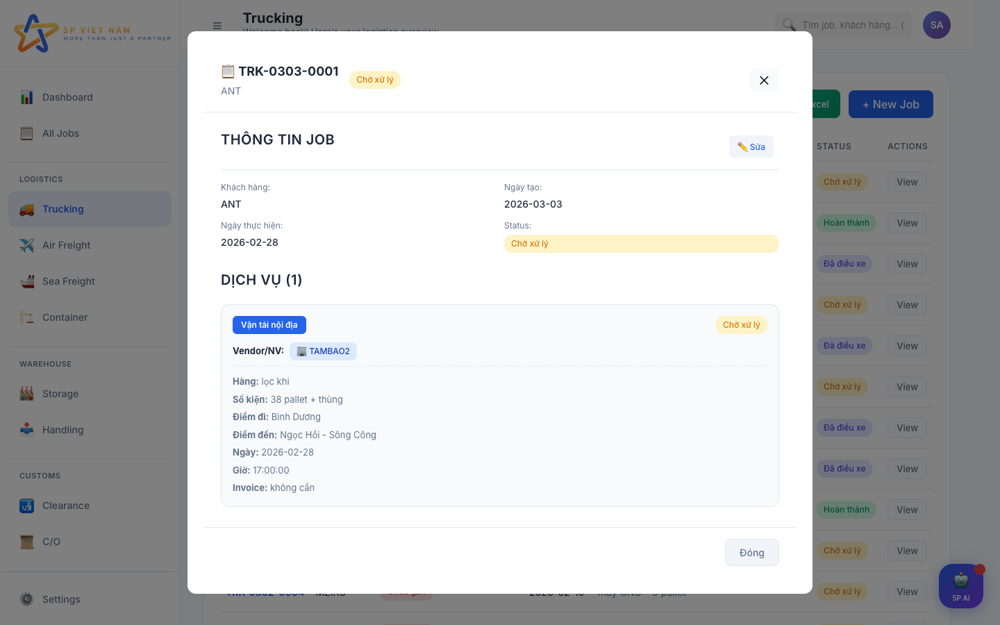
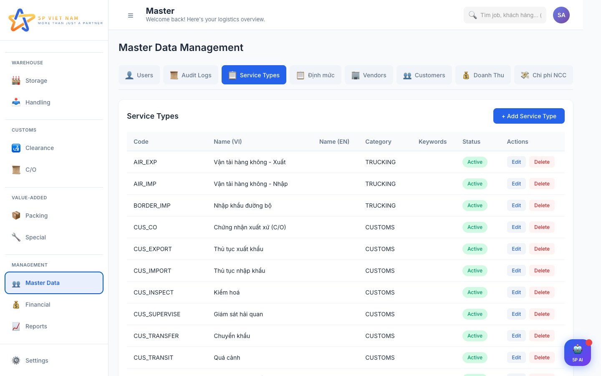
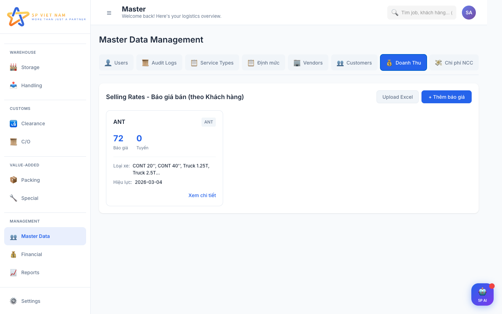
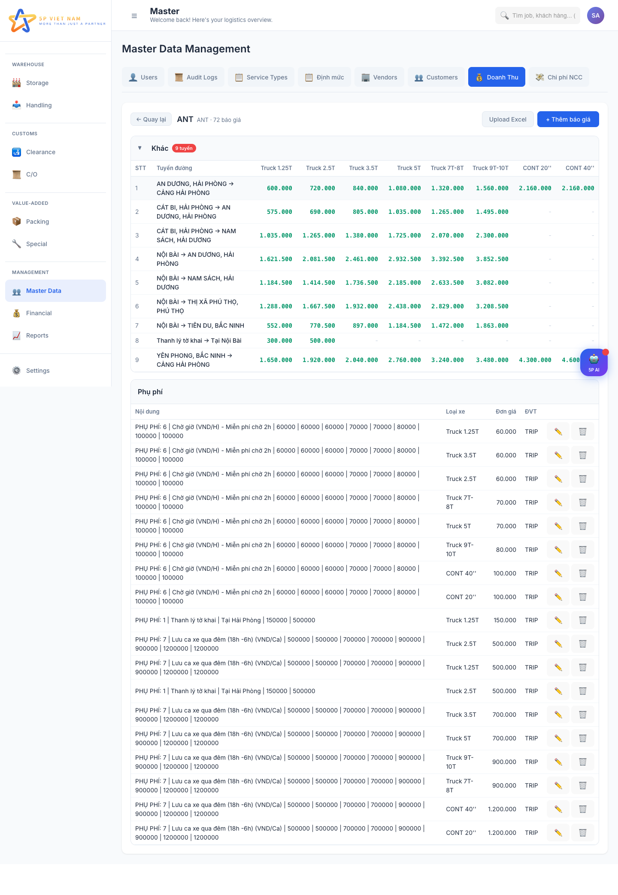
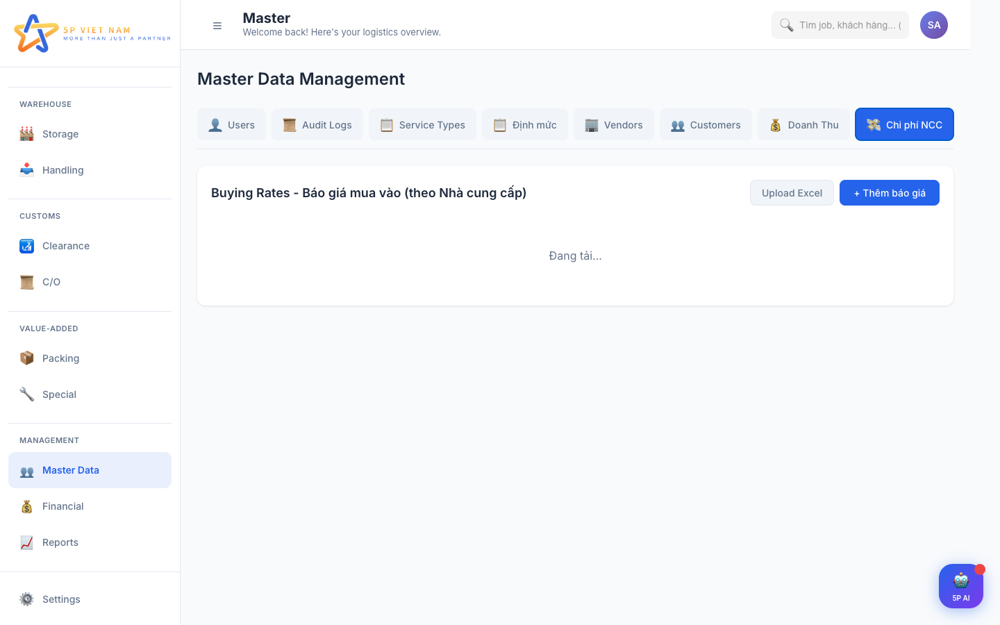

# Hướng Dẫn Sử Dụng Hệ Thống 5P SLMS

> **Phiên bản:** 1.0 | **Cập nhật:** 05/03/2026

---

## Mục Lục

1. [Đăng nhập](#1-đăng-nhập)
2. [Tổng quan giao diện](#2-tổng-quan-giao-diện)
3. [Dashboard](#3-dashboard)
4. [Quản lý đơn hàng (Jobs)](#4-quản-lý-đơn-hàng-jobs)
5. [Tạo đơn hàng mới (Manual)](#5-tạo-đơn-hàng-mới-manual)
6. [Chi tiết đơn hàng](#6-chi-tiết-đơn-hàng)
7. [Chat AI - Trợ lý 5P](#7-chat-ai---trợ-lý-5p)
8. [Quản lý dữ liệu (Master Data)](#8-quản-lý-dữ-liệu-master-data)
9. [Báo giá bán (Doanh Thu)](#9-báo-giá-bán-doanh-thu)
10. [Báo giá mua (Chi phí NCC)](#10-báo-giá-mua-chi-phí-ncc)
11. [Phím tắt](#11-phím-tắt)

---

## 1. Đăng nhập

**Bước thực hiện:**
1. Truy cập hệ thống tại địa chỉ website
2. Nhập **Email** (ví dụ: `ha.dt@5pvietnam.com`)
3. Nhập **Mật khẩu**
4. Bấm **Đăng nhập**

**Phân quyền:**
| Vai trò | Quyền hạn |
|---------|-----------|
| **ADMIN** | Toàn bộ chức năng, bao gồm quản lý Users và Audit Logs |
| **MANAGER** | Toàn bộ chức năng, trừ quản lý Users và Audit Logs |
| **STAFF** | Xem và thao tác đơn hàng, không truy cập Master Data |

---

## 2. Tổng quan giao diện

Giao diện chia làm 3 phần chính:

### Thanh bên trái (Sidebar)
Các mục điều hướng chính:

| Nhóm | Mục | Chức năng |
|------|-----|-----------|
| **Tổng quan** | Dashboard | Bảng thống kê tổng quan |
| | All Jobs | Xem tất cả đơn hàng |
| **Logistics** | Trucking | Đơn vận tải đường bộ |
| | Air Freight | Đơn hàng không |
| | Sea Freight | Đơn đường biển |
| | Container | Đơn nâng hạ container |
| **Warehouse** | Storage | Lưu kho |
| | Handling | Bốc xếp |
| **Customs** | Clearance | Thông quan |
| | C/O | Chứng nhận xuất xứ |
| **Value-Added** | Packing | Đóng gói |
| | Special | Dịch vụ đặc biệt |
| **Management** | Master Data | Quản lý dữ liệu gốc |
| | Financial | Tài chính |
| | Reports | Báo cáo |

### Thanh trên (Header)
- **Ô tìm kiếm**: Tìm nhanh job, khách hàng, nhà cung cấp
- **Avatar**: Thông tin tài khoản, đăng xuất

### Nút AI Chat (góc phải dưới)
- Bấm nút **5P AI** để mở cửa sổ trợ lý AI

---

## 3. Dashboard

Dashboard hiển thị 4 thẻ thống kê:
- **Jobs Today**: Số đơn hàng trong ngày
- **Active Trucking**: Số đơn vận tải đang hoạt động
- **In Storage**: Số đơn đang lưu kho
- **Doanh thu**: Tổng doanh thu (VND)

Bên dưới có:
- **Jobs by Status**: Biểu đồ số lượng đơn theo trạng thái
- **Recent Jobs**: 5 đơn hàng gần nhất (bấm vào để xem chi tiết)

---

## 4. Quản lý đơn hàng (Jobs)

### Xem danh sách
- Chọn mục tương ứng ở sidebar (Trucking, Air Freight, ...)
- Hoặc chọn **All Jobs** để xem tất cả
- Mỗi dòng hiển thị: Mã job, Khách hàng, Loại dịch vụ, Ngày, Trạng thái

### Các trạng thái đơn hàng

| Trạng thái | Ý nghĩa | Màu |
|------------|---------|-----|
| **Chờ xử lý** (PENDING) | Đơn mới tạo, chưa xác nhận | Vàng |
| **Đã xác nhận** (CONFIRMED) | Đã xác nhận đơn | Xanh dương |
| **Đã điều xe** (DISPATCHED) | Đã gán xe/NCC | Tím |
| **Đang vận chuyển** (IN_TRANSIT) | Đang giao hàng | Xanh dương |
| **Hoàn thành** (COMPLETED) | Đã giao xong | Xanh lá |
| **Đã huỷ** (CANCELLED) | Đơn bị huỷ | Đỏ |

### Tìm kiếm & Lọc
- Dùng **ô tìm kiếm** ở header để tìm theo mã job, tên khách hàng, NCC
- Bấm **Export Excel** để xuất danh sách ra file Excel (có thể chọn tháng)

---

## 5. Tạo đơn hàng mới (Manual)

### Bước thực hiện:
1. Bấm nút **+ New Job** (góc phải trên)
2. Điền thông tin:

**Thông tin cơ bản (bắt buộc):**
- **Khách hàng**: Chọn từ danh sách dropdown
- **Ngày booking**: Ngày tạo đơn
- **Giờ lấy hàng**: Giờ dự kiến lấy hàng

**Thông tin hàng hoá:**
- **Loại hàng**: VD: PCB, FPC, Electronics
- **Số kiện**: Số lượng kiện hàng
- **Đơn vị**: Kiện, thùng, pallet, container
- **Khối lượng (kg)**: Trọng lượng hàng

**Địa chỉ:**
- **Điểm lấy hàng**: VD: KCN Quang Minh
- **Điểm giao hàng**: VD: Sân bay Nội Bài

3. Bấm **Tạo Job** để lưu

> **Lưu ý:** Bạn cũng có thể tạo đơn qua **Chat AI** bằng cách nhắn tin mô tả đơn hàng (xem mục 7).

---

## 6. Chi tiết đơn hàng

### Xem chi tiết
- Bấm vào bất kỳ dòng nào trong danh sách → Mở popup chi tiết
- Hiển thị: Mã job, khách hàng, ngày tạo, trạng thái, danh sách dịch vụ

### Chỉnh sửa
1. Bấm nút **Sửa** (biểu tượng bút) để bật chế độ chỉnh sửa
2. Có thể thay đổi:
   - **Khách hàng**: Đổi khách hàng cho đơn
   - **Trạng thái**: Cập nhật trạng thái từng dịch vụ
   - **Vendor/NCC**: Gán nhà cung cấp cho dịch vụ (tìm kiếm theo tên, tự động lưu)
   - **Thông tin chi tiết dịch vụ**:
     - Loại hàng, số kiện, đơn vị
     - Điểm đi, điểm đến
     - Ngày giờ dự kiến
     - Số invoice
     - Thêm thông tin bổ sung (nút "+ Thêm thông tin")

### Báo giá (Quotation)
Mỗi dịch vụ có 2 loại báo giá:
- **Chi phí (Buying)**: Giá mua từ NCC
- **Doanh thu (Selling)**: Giá bán cho khách hàng

**3 cách chọn báo giá:**

| Cách | Mô tả |
|------|-------|
| **Định mức** | Giá chuẩn từ hệ thống |
| **NCC** | Giá từ bảng báo giá NCC (tìm kiếm được) |
| **Nhập tay** | Tự nhập giá, đơn vị, số lượng |

**Tìm kiếm báo giá:**
- Gõ vào ô tìm kiếm trong dropdown (hỗ trợ tiếng Việt không dấu)
- VD: gõ "noi bai" sẽ tìm được "Nội Bài"

---

## 7. Chat AI - Trợ lý 5P

### Mở Chat
- Bấm nút **5P AI** ở góc phải dưới màn hình
- Hoặc nhấn **Ctrl+K** (Windows) / **Cmd+K** (Mac)

### Các lệnh AI hỗ trợ

| Bạn nhắn | AI sẽ làm |
|-----------|-----------|
| "Đặt xe cho MEIKO ngày mai đi Bình Dương" | Tạo đơn hàng mới với thông tin KH, ngày, tuyến đường |
| "Gán xe cho job TRK-0303-0001" | Gán NCC/xe cho đơn hàng |
| "Cập nhật trạng thái job đã giao" | Chuyển trạng thái đơn hàng |
| "Job TRK-0303-0001 đi tới đâu rồi?" | Tra cứu thông tin đơn hàng |
| "Tạo khách hàng mới ABC Logistics" | Thêm khách hàng vào hệ thống |
| "Thêm NCC mới Vận tải XYZ" | Thêm nhà cung cấp mới |
| "Tạo báo giá cho MEIKO" | Tạo báo giá bán/mua |

### Gửi file cho AI
- **Kéo thả** hoặc **dán** file vào cửa sổ chat
- Hỗ trợ các loại file:
  - **Excel (.xlsx)**: AI đọc và trích xuất thông tin booking, báo giá
  - **PDF**: AI đọc nội dung tài liệu
  - **Hình ảnh (.png, .jpg)**: AI nhận diện chữ trong ảnh (OCR)

### Quy trình xác nhận
- Khi AI thực hiện hành động quan trọng (tạo đơn, gán xe...), sẽ **hỏi xác nhận** trước
- Bấm **Xác nhận** để thực hiện hoặc **Huỷ** để bỏ qua

---

## 8. Quản lý dữ liệu (Master Data)

Truy cập: **Sidebar → Master Data**

### Các tab quản lý

| Tab | Chức năng | Ghi chú |
|-----|-----------|---------|
| **Users** | Quản lý tài khoản người dùng | Chỉ ADMIN |
| **Audit Logs** | Nhật ký hoạt động hệ thống | Chỉ ADMIN |
| **Service Types** | Danh mục loại dịch vụ | |
| **Định mức** | Giá chuẩn cho từng dịch vụ | |
| **Vendors** | Danh sách nhà cung cấp | |
| **Customers** | Danh sách khách hàng | |
| **Doanh Thu** | Báo giá bán (theo khách hàng) | |
| **Chi phí NCC** | Báo giá mua (theo NCC) | |

### Thao tác chung
- **Thêm mới**: Bấm nút **+ Thêm** → Điền form → **Lưu**
- **Sửa**: Bấm biểu tượng bút ✏️ trên dòng cần sửa
- **Xoá**: Bấm biểu tượng thùng rác 🗑️ → Xác nhận
- **Upload Excel**: Bấm **Upload Excel** để nhập dữ liệu hàng loạt

---

## 9. Báo giá bán (Doanh Thu)

### Xem báo giá
1. Vào **Master Data → Doanh Thu**
2. Hệ thống hiển thị **thẻ khách hàng** với thông tin:
   - Tên khách hàng, mã
   - Số báo giá, số tuyến
   - Loại xe, ngày hiệu lực
3. Bấm **Xem chi tiết** để xem bảng giá

### Chi tiết báo giá (dạng bảng Excel)

- Báo giá được nhóm theo **loại dịch vụ** (Vận tải, Hải quan, ...)
- Mỗi nhóm hiển thị dạng **bảng ma trận**:
  - **Hàng**: Tuyến đường (Điểm đi → Điểm đến)
  - **Cột**: Loại xe (Truck 1.25T, 2.5T, ... CONT 20'', 40'')
  - **Ô**: Đơn giá (VND)
- **Phụ phí**: Hiển thị riêng bên dưới (chờ giờ, lưu ca, huỷ chuyến...)

### Sửa báo giá
- **Bấm vào ô giá** trong bảng → Mở form sửa báo giá
- Ô giá có **gạch chân xanh** khi rê chuột = có thể bấm sửa
- Phụ phí: Bấm ✏️ hoặc 🗑️ để sửa/xoá

### Thêm báo giá mới
- Bấm **+ Thêm báo giá** → Điền form:
  - Khách hàng, loại dịch vụ
  - Điểm đi, điểm đến
  - Loại xe, đơn giá, đơn vị tính
  - Ngày hiệu lực
- Bấm **Lưu**

---

## 10. Báo giá mua (Chi phí NCC)

### Xem báo giá
1. Vào **Master Data → Chi phí NCC**
2. Hệ thống hiển thị **thẻ NCC** với thông tin:
   - Tên NCC, mã
   - Số rates, số tuyến
   - Loại xe
3. Bấm **Xem chi tiết** → Hiển thị theo tuyến đường

### Chi tiết báo giá NCC
- Nhóm theo **tuyến đường chính** (VD: NỘI BÀI → ...)
- Bấm vào tuyến để mở/đóng chi tiết
- Mỗi tuyến con hiển thị: Loại xe, giá, đơn vị

### Bộ lọc
- **Tìm theo địa điểm**: Gõ tên tuyến (hỗ trợ không dấu)
- **Lọc theo loại xe**: Chọn từ dropdown
- **Lọc theo khoảng giá**: Nhập giá từ - đến

---

## 11. Phím tắt

| Phím tắt | Chức năng |
|----------|-----------|
| `Ctrl+K` / `Cmd+K` | Mở/đóng AI Chat |
| `Ctrl+N` / `Cmd+N` | Tạo đơn hàng mới |
| `Ctrl+F` / `Cmd+F` | Focus ô tìm kiếm |
| `ESC` | Đóng popup/modal |
| `1` - `9` | Chuyển nhanh giữa các trang |

---

## Hỗ trợ

Nếu gặp vấn đề khi sử dụng, vui lòng liên hệ:
- **Admin hệ thống**: admin@5pvietnam.com
- **Hotline**: Liên hệ quản lý trực tiếp
